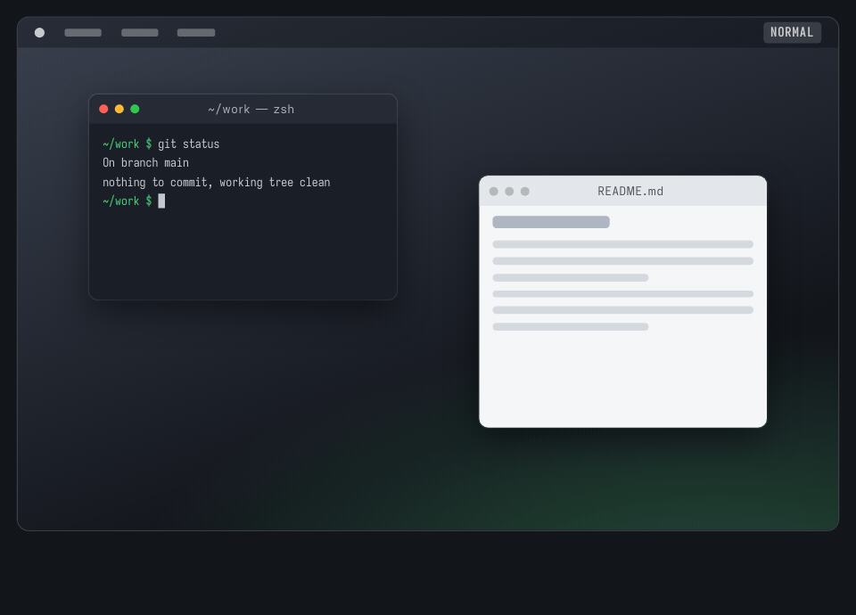

# Vimdow

**Website:** [vimdow.told.me](https://vimdow.told.me) · English, 한국어, 日本語, 简体中文

**Download:** [Vimdow.zip](https://github.com/rath/Vimdow/releases/latest/download/Vimdow.zip)
for macOS 14 or later, signed and notarized · [Release notes](https://github.com/rath/Vimdow/releases/latest)

Vimdow is a keyboard-driven window manager for macOS. Press a shortcut to enter
command mode, then move, resize, snap, and switch windows with `h`, `j`, `k`,
`l`, counts, and the other Vim habits already in your fingers. The mouse stays
where it is.



## Why Vimdow

Vimdow was written by someone who has used Vim since 1998 and would rather not
reach for the mouse. Most of a Mac can be driven from the keyboard, but window
management could not: nudging a window a few points, or moving it to another
display, always meant leaving the home row.

The first version, in 2013, was a small Objective-C app that fixed exactly that
for exactly one user. Instead of inventing new shortcuts, it mapped window
operations onto the Vim vocabulary its author already knew: `hjkl` to move, a
count to repeat, `0` and `$` for the edges, `gg` and `G` for top and bottom,
`zz` to center, `u` to undo, `/` to search. It makes no claim to be a general
approach to window management. It is one person's preference, written down as
code and used daily since.

In 2026 the app was rewritten in Swift 6 with a tested command engine, and new
window-management features have been added since. It is published for anyone
whose hands have the same habits.

## Getting started

1. Download [Vimdow.zip](https://github.com/rath/Vimdow/releases/latest/download/Vimdow.zip)
   from the [latest release](https://github.com/rath/Vimdow/releases/latest)
   and move **Vimdow.app** to Applications.
2. Open it and allow it in **System Settings → Privacy & Security →
   Accessibility**.
3. Press **Control–Option–A** to enter command mode, and `,` there to open
   Settings.

The app is signed with Developer ID and notarized by Apple. To build it
yourself, follow [Development](#development); the
[signing notes](#signing-and-permissions) explain how to keep Accessibility
permission across rebuilds.

## Controls

### Normal mode

| Keys | Action |
| --- | --- |
| Control–Option–A | Enter command mode (customizable in Settings) |
| Control–Shift–H / J | Focus the previous window, ordered by horizontal position |
| Control–Shift–K / L | Focus the next window |
| Control–Option–Tab | Focus the next marked window (customizable in Settings) |

### Command mode

| Keys | Action |
| --- | --- |
| H / J / K / L | Move left / down / up / right by the configured step (default 20 points) |
| Option–H / J / K / L | Resize, keeping the top-left corner fixed |
| Shift–H / J / K / L | Resize, keeping the bottom-right corner fixed |
| Digits, then a movement or resize | Repeat the operation, e.g. `12j` moves down 240 points |
| U / Control–R | Undo / redo the focused window's last move, resize, snap, tiling, or display move |
| 0 / $ (Shift–4) | Move to the left / right edge of the display, keeping the size |
| G, then G / Shift–G | Move to the top / bottom edge, keeping the size |
| Z, then Z | Center on the display, keeping the size |
| Control–W, then Shift–H / J / K / L | Fill the left / bottom / top / right half of the display |
| Control–W, then O | Fill the display |
| Q, then 1–9 | Focus a numbered window and exit command mode |
| Q again | Show the next page of up to nine windows, wrapping after the last page |
| M | Mark / unmark the focused window and exit command mode |
| / | Search by application name |
| , | Open Settings |
| N / Shift–N | Next / previous match for the last search |
| Control–Option–K / L | Move to the next display; restore its saved window frame, or fill it on the first visit |
| Escape / . | Exit command mode |
| X | Quit Vimdow |

By default, enlarging a window with Option or Shift stops at the menu bar, the
Dock, and the edges of the display containing most of the window; an edge
already beyond them stays where it is. Turn off **Stop resizing at display
edges** in Settings to resize across displays. Movement is never limited.

Moving and resizing also glide by default: each step eases into place, and a
held key moves or resizes the window continuously at the same speed as its key
repeat. Every glide ends exactly where the steps put the window. Turn off
**Animate moving and resizing** in Settings to apply each step at once. Display
moves are not animated.

U undoes the focused window's last move, resize, snap, tiling, or display move,
and Control–R redoes it. Each window has its own history while Vimdow is running,
and a count repeats either key, e.g. `3u`. Repeating one move or resize without
a count, including holding its key, makes a single change. A count, any other
command, or leaving command mode starts a new change, and a new change clears
the window's redo history. Undo restores the recorded frame even if the window
was moved by other means since, and redo then returns it there. Undo and redo
glide like the steps they pass and jump across display moves. Vimdow keeps the
last 100 changes for each of the 50 windows changed or restored most recently.

Snaps and tiling use the display holding most of the window, without the menu
bar and the Dock, so `zz` also brings back a window that has strayed mostly off
screen. `0`, `$`, `gg`, `G`, and `zz` keep the window's size, even when it is
larger than the display; the halves and Control–W, O set it. A two-key command
waits for its second key, and any other key cancels it and does nothing. A count
before these commands is ignored, and 0 begins a snap only when no count is
being typed, so `10j` still moves ten steps. Snaps and tiling glide like moves
and resizes, each is one undo change, and one that changes nothing, such as
tiling a tiled window again, does nothing. While command mode is active,
Control–W does not reach the frontmost app.

H/J/K/L and the normal-mode focus shortcuts repeat while held, using macOS key
repeat settings. The key bindings use physical ANSI key positions, as in the
original app. Search accepts normal text input, including input methods; Enter
submits and Escape cancels. Cancelling returns to command mode and restores the
previous window when it is still available. Window operations unsupported by a
particular app fail safely with a beep and a diagnostic in Console.

While in command mode, number prefixes also apply to the Control–Shift focus
shortcuts and N/Shift–N. Plain focus cycling stops at either end; search cycles
through matching applications.
In numbered selection, 0 and numbers without a displayed window are ignored.
Numbers appear in large, translucent black badges centered on each window.
Overlapping badges spread into a grid near their centers so every number remains
readable; badges near display edges stay on screen.
After three seconds without keyboard input, numbered selection cancels and
normal typing resumes. Pressing Q again or another key restarts this timeout
if numbered selection remains active.

### Marked windows

To switch between just a Ghostty window and a Chrome window, enter command mode
in each and press **M**. A brief **Marked** confirmation appears and normal typing
resumes. Press **Control–Option–Tab** to alternate between them, without entering
command mode. Press M in command mode again to unmark a window.
The newly focused window briefly flashes with an accent-colored outline and a
faint tint, pulsing twice over 0.36 seconds. Reduce Motion uses a single
gentle outline fade over the same duration.

Marks identify specific windows, so other windows of the same app are excluded.
Three or more marks cycle in registration order, wrapping at the end; unmarking
and marking again moves a window to the end. From an unmarked window, switching
starts at the first available mark. Existing full-window shortcuts are unchanged.

Only windows currently shown on the desktop, across all displays, participate.
Minimized windows, hidden apps, and windows on another Space are skipped but keep
their marks until they return. Closed windows and terminated apps are removed on
the next mark operation or marked switch; new windows are not automatically marked.
Marks last only while Vimdow is running.

A single available mark focuses that window, or does nothing if already focused.
If none are available, a brief notice explains why. Switching leaves the pointer
in place and exits command mode or numbered selection. Both mark commands ignore
counts and run once per press, without held-key repeat. They are suspended during
search and Settings input.

### Display movement

Display movement remembers each window's last position and size on each display
while Vimdow is running. Returning to a display restores that frame, including
manual adjustments made before leaving it. A single display is left unchanged.
Changing the display layout or resolution clears this history. Restoration is
subject to the target app's size and position constraints.

The legacy F9/F10 volume shortcuts and F13 iTunes control have been removed.

## Settings

Enter command mode (default **Control–Option–A**), release the keys, then press
**comma (`,`)**. You can also use **Vimdow → Settings…** (**Command–,**) while
Vimdow is active, or reopen the running app from `/Applications`.

- **General:** set separate movement and resize steps (1–200 points, default 20),
  choose whether resizing stops at display edges and whether moving and resizing
  animate (both on by default), choose **Fill Display** or **Keep Size** for a
  window's first visit to a display, and check Accessibility permission. Keep
  Size preserves the offset from the source display, fitting the window within
  smaller displays when necessary.
- **Shortcuts:** customize or clear the six global shortcuts. Command-mode keys
  remain fixed and are listed for reference. Duplicate assignments and detected
  system/menu conflicts are rejected. If you clear the entry shortcut, reopen
  Vimdow from Applications to reach Settings again.
- Changes apply immediately and persist across launches. **Restore Defaults**
  resets only the current tab. Invalid numeric input is not saved.
- All Vimdow shortcuts are suspended while Settings has keyboard focus. Switching
  to another app or closing Settings returns to normal mode. Settings can be used
  without Accessibility permission.

Returning to a previously visited display still restores its saved window frame.
Changing the display-movement option clears that history. Settings use local
`UserDefaults`; they are separate from the build-signing configuration.

## Roadmap

Vimdow is a window manager first, and that is where the work is going. More
window-management features are planned and will land one at a time, each
reachable from command mode without touching the mouse. Two things stay fixed:
the Vim-style command model, and the physical `hjkl` layout. Anything that only
makes sense with a pointer does not belong here.

Bug reports and ideas are welcome as
[issues](https://github.com/rath/Vimdow/issues).

## Requirements

- **Running:** macOS **14 or later**, with Accessibility permission.
- **Building:** **Xcode 27.0** (Swift 6.4, Swift 6 language mode), selected with
  `xcode-select` or `DEVELOPER_DIR`. Xcode itself requires macOS 26.6 or later.
- **Project generation:** [XcodeGen 2.46.0](https://github.com/yonaskolb/XcodeGen/releases/tag/2.46.0), on your `PATH`.

Dependencies use Swift Package Manager. Ruby and CocoaPods are no longer required.
KeyboardShortcuts is pinned to **3.1.0**.

## Development

From a fresh checkout:

```sh
./scripts/setup.sh
open VimdowManager.xcodeproj
```

Setup checks tool versions, generates the Xcode project, restores the tracked
`Package.resolved`, and resolves the pinned dependencies. The first run needs
network access. The script works from any directory and stops on failure; it
does not install tools automatically.

When upgrading from the CocoaPods version, close the old `.xcworkspace` and open
the generated `.xcodeproj`. Old ignored `Pods/` and workspace files are unused.

### Source of truth

- `project.yml` defines targets, build settings, schemes, and package versions.
- `Package.resolved` at the repository root locks dependency revisions. Setup
  copies it into the generated project's SwiftPM directory and verifies that
  resolution leaves it unchanged.
- Generated Xcode projects, workspaces, and `DerivedData/` stay out of Git.
- After adding/removing sources or changing project settings, rerun setup.
  Changes made only through Xcode project settings are overwritten.
- `Artwork/launcher.svg` is the app icon, and `Artwork/launcher-small.svg` its
  simplified 16 and 32 px rendition. After editing either, run
  `./scripts/generate-app-icon.sh` to render the PNGs in
  `VimdowManager/Assets.xcassets`; do not edit those PNGs directly. The script
  needs `rsvg-convert` from librsvg (`brew install librsvg`).

To deliberately update a dependency, edit its version in `project.yml`, run
`xcodegen generate`, and resolve it with `xcodebuild -resolvePackageDependencies
-project VimdowManager.xcodeproj -scheme VimdowManager -derivedDataPath DerivedData`.
Review the generated `VimdowManager.xcodeproj/project.xcworkspace/xcshareddata/swiftpm/Package.resolved`
and copy it to the repository root. Review both files together, then rerun setup.

### Build

```sh
xcodebuild -project VimdowManager.xcodeproj -scheme VimdowManager \
  -configuration Debug -derivedDataPath DerivedData \
  -onlyUsePackageVersionsFromResolvedFile build
xcodebuild -project VimdowManager.xcodeproj -scheme VimdowManager \
  -configuration Release -derivedDataPath DerivedData \
  -onlyUsePackageVersionsFromResolvedFile build
```

Debug builds for the host architecture. Release builds support Apple Silicon
and Intel. The app bundle is `DerivedData/Build/Products/<configuration>/Vimdow.app`.

### Signing and permissions

Both configurations default to **ad-hoc signing**, without a development team,
through `Config/Signing.xcconfig`. For regular local use, select an installed
**Apple Development** certificate once:

```sh
cp Config/Signing.local.xcconfig.example Config/Signing.local.xcconfig
security find-identity -v -p codesigning
```

Set `CODE_SIGN_IDENTITY` in the local file to that identity's SHA-1 fingerprint
and `DEVELOPMENT_TEAM` to its Team ID. The fingerprint selects the exact
certificate even when multiple certificates have the same name. Its private key
must be available in your keychain. Run `./scripts/setup.sh`, then build normally.
Both Xcode and command-line Debug/Release builds use this file, including after
project regeneration. Later edits to the local file do not require regeneration.

`Config/Signing.local.xcconfig` is ignored by Git. Keep personal signing settings
out of the tracked template and `project.yml`. Remove the local file to restore
ad-hoc signing. Public releases are signed with Developer ID instead; see
[Releasing](#releasing).

**To avoid re-registering Accessibility permission after each rebuild, sign
every build with the same Apple Development certificate and keep the bundle
identifier unchanged.** With this stable signing identity, macOS can normally
recognize updated builds and retain permission. Ad-hoc signing does not provide
this continuity when the binary changes.

Switching from ad-hoc signing may require removing and re-adding the app **once**
using the steps below. Install and launch successive builds at the same
`/Applications/Vimdow.app` path.
When the certificate expires or is replaced, update the local fingerprint and
check permission again.

On first launch, enable Vimdow in **System Settings → Privacy & Security →
Accessibility**. The app can open this pane and recheck permission; denial does
not terminate it. If you chose Later, enter command mode and try a window command
to retry, or open Vimdow Settings to check permission. Rebuilding
or moving an ad-hoc signed app may leave an enabled entry that still identifies
the previous binary. If permission is rejected despite the switch being on:

1. Quit Vimdow.
2. Select its Accessibility entry and remove it with the minus button.
3. Use the plus button to add `/Applications/Vimdow.app` and enable it.
4. Relaunch that installed app, then enter command mode and try moving a window.

Simply toggling the old entry may not refresh its stored signing requirement.

### Tests

Pure command and geometry tests run without launching Vimdow or granting
Accessibility permission:

```sh
xcodebuild -project VimdowManager.xcodeproj -scheme VimdowCore \
  -destination 'platform=macOS' -derivedDataPath DerivedData \
  -onlyUsePackageVersionsFromResolvedFile test
```

The separate shortcut integration test **briefly registers the real global
shortcuts**. Run it on an interactive Mac with other Vimdow instances closed:

```sh
xcodebuild -project VimdowManager.xcodeproj -scheme VimdowShortcuts \
  -destination 'platform=macOS' -derivedDataPath DerivedData \
  -onlyUsePackageVersionsFromResolvedFile test
```

It checks modifier-free shortcuts, repeated mode entry, and registration cleanup
when entering search, returning to normal mode, and stopping. Actual key-repeat
behavior, IME input, and controlling other apps require the manual checks in
[docs/testing.md](docs/testing.md).

The AppKit presentation tests briefly show the search panel on an interactive
Mac. They check focus, prevent accidental submission during activation, and
exercise Return/Escape with committed and marked text:

```sh
xcodebuild -project VimdowManager.xcodeproj -scheme VimdowPresentation \
  -destination 'platform=macOS' -derivedDataPath DerivedData \
  -onlyUsePackageVersionsFromResolvedFile test
```

### Releasing

Releases are built on the maintainer's Mac and published as a notarized
`Vimdow.zip` on [GitHub Releases](https://github.com/rath/Vimdow/releases).
`releases/latest/download/Vimdow.zip` always points at the newest one.

One-time setup:

1. Create a **Developer ID Application** certificate (Xcode → Settings →
   Accounts → Manage Certificates → + ). Only the team's Account Holder can.
   Back up the certificate with its private key as a `.p12`.
2. Create an app-specific password at [account.apple.com](https://account.apple.com)
   (Sign-In and Security → App-Specific Passwords), then store it for notarytool:

   ```sh
   xcrun notarytool store-credentials vimdow-notary \
     --apple-id <apple-id-email> --team-id <team-id>
   ```

For each release, from a clean `HEAD`, run:

```sh
./scripts/release.sh patch   # or minor, major, or an explicit version like 1.4.0
```

The argument raises `MARKETING_VERSION` in `project.yml`, adds one to the build
number `CURRENT_PROJECT_VERSION`, and commits both as
`chore(release): bump version to <version>`. Without an argument the script
releases the version already in `project.yml`; use that for the first release or
to retry after a failure, since a failed run keeps the bump commit.

The script then runs the core tests, archives a universal Release build, signs
it with Developer ID and the hardened runtime, notarizes and staples it, writes
`build/release/Vimdow.zip`, and tags the commit `v<version>`. It publishes
nothing; it prints the commands to push the tag and create a draft release. Set
`NOTARY_PROFILE` to use another keychain profile.

### Architecture

- **VimdowCore:** command state, repeat counts, undo history, window selection,
  geometry, placement, and glide motion; tested with Swift Testing and fake
  window/presentation implementations.
- **WindowService:** checked Accessibility calls and Quartz window discovery,
  with bounded AX messaging timeouts. Window identity uses AX elements, so equal
  positions and sizes do not confuse focus selection. Its WindowAnimator applies
  glides in step with the display refresh.
- **ShortcutController:** KeyboardShortcuts registration and held-key repetition.
- **AppKit presentation:** native search text field and nonactivating numbered
  panels. UI and command coordination use `@MainActor`.
- **SettingsStore / SettingsWindowController:** persisted preferences and the
  native settings window. Global shortcuts use KeyboardShortcuts' saved values.

## Credits

- Original implementation: Jang Ho Hwang (2013–2014).
- Original command-window implementation: Yoo Yong-Ha (2013).
- [KeyboardShortcuts](https://github.com/sindresorhus/KeyboardShortcuts)
- The original Objective-C version used [MASShortcut](https://github.com/shpakovski/MASShortcut).

## License

Vimdow is licensed under the [BSD 3-Clause License](LICENSE) (`BSD-3-Clause`).
The license and original author credits are included in the app bundle.

KeyboardShortcuts is distributed under its own MIT license; see
[ThirdPartyNotices.txt](VimdowManager/ThirdPartyNotices.txt).
